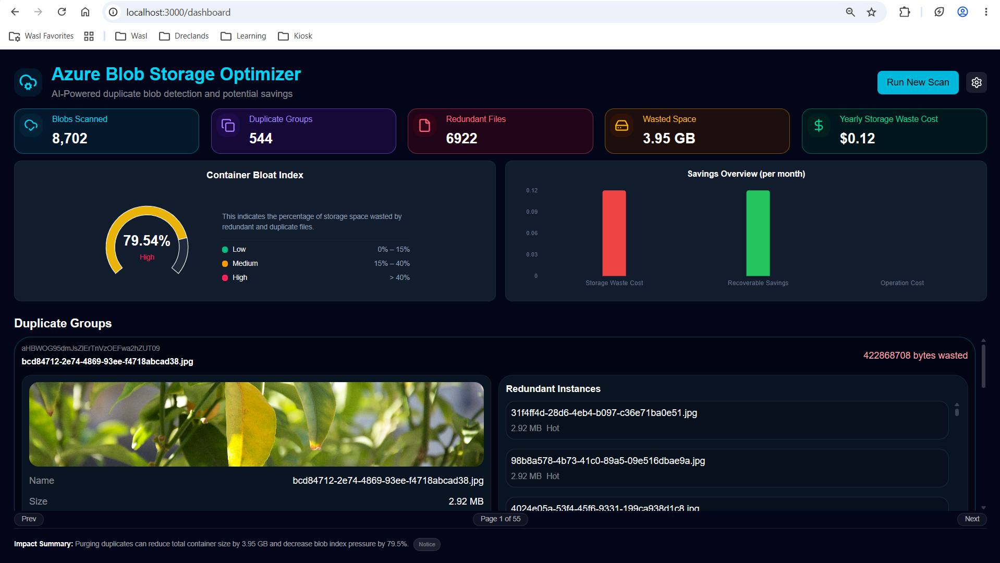
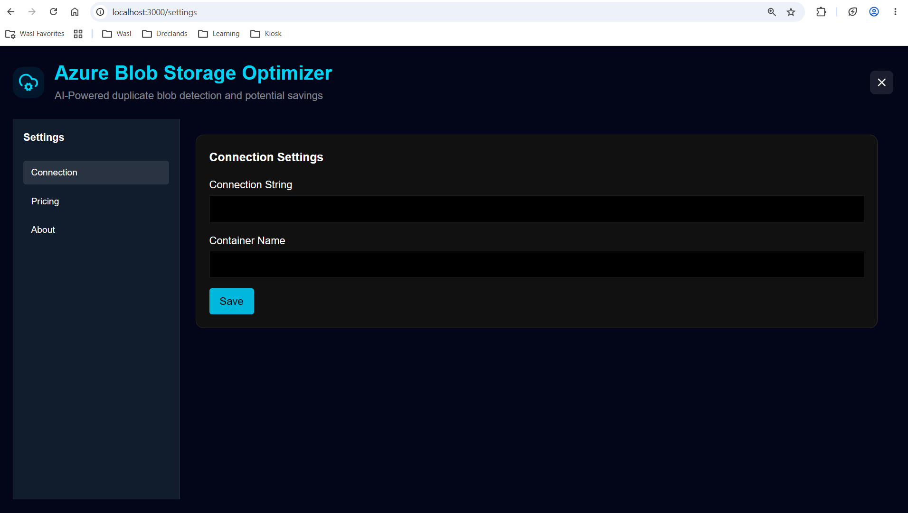
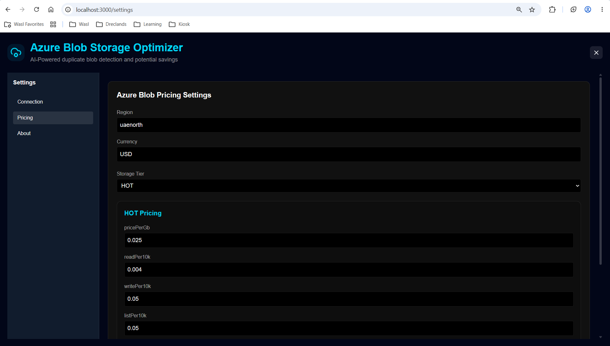
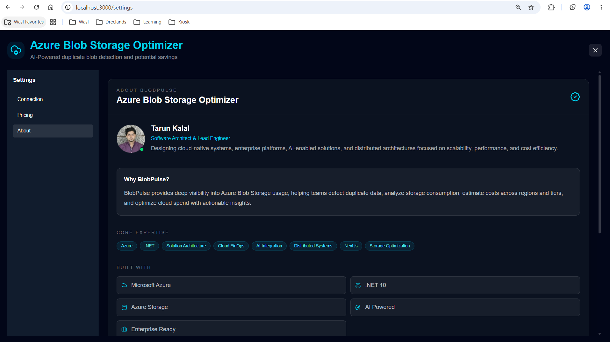

# BlobPulse

<p align="center">



</p>

<h3 align="center">
Azure Blob Storage Optimization Engine
</h3>

<p align="center">

Analyze Azure Blob Storage at scale, identify duplicate blobs, estimate storage waste, and calculate potential cloud cost savings through a modern, enterprise-ready dashboard.

</p>

<p align="center">


</p>

---

# Overview

BlobPulse is an enterprise-grade Azure Blob Storage analytics platform designed to help organizations discover redundant storage, identify duplicate files, estimate financial waste, and optimize cloud storage costs without modifying production data.

Unlike traditional storage explorers, BlobPulse focuses on actionable insights rather than file browsing.

The application performs metadata analysis only and operates in **read-only mode**, making it safe for production environments.

---

# Features

## Duplicate Detection

Detect identical blobs across one or multiple containers using metadata comparison.

✔ Duplicate Groups

✔ Redundant Blob Discovery

✔ Hash-based Identification

✔ Storage Reclamation Estimates

---

## Storage Analytics

Understand storage utilization through an interactive dashboard.

- Blob Count
- Duplicate Percentage
- Container Bloat Index
- Storage Consumption
- Waste Distribution
- Monthly Cost Estimation

---

## Cost Optimization

Convert duplicate storage into financial metrics.

- Monthly Waste
- Recoverable Savings
- Storage Tier Pricing
- Regional Pricing Support

---

## Enterprise Security

BlobPulse never modifies Azure Storage.

Features include:

- Read-only SAS Authentication
- Metadata-only Analysis
- Zero File Uploads
- Zero Blob Modification
- Private Network Deployment
- On-Premises Support

---

## Modern Dashboard

- Dark Theme
- High-density Layout
- Interactive Charts
- Duplicate Browser
- Pricing Calculator
- Real-time Statistics

---

# Screenshots

## Dashboard


---

## Connection Settings



---

## Pricing Configuration



---

## About Page



---

# Architecture

```
                    Azure Blob Storage

                           │
                           │
                 Read-Only SAS Access
                           │
                           ▼

                  .NET 10 Metadata Engine

                           │
                           ▼

               Duplicate Detection Engine

                           │
                           ▼

                 Cost Analysis Service

                           │
                           ▼

                  Next.js Dashboard UI
```

---

# Technology Stack

| Component | Technology |
|------------|------------|
| Frontend | Next.js 15 |
| Backend | ASP.NET Core .NET 10 |
| UI | React |
| Styling | Tailwind CSS |
| Charts | Recharts |
| Storage SDK | Azure Storage SDK |
| Authentication | Azure SAS |
| Deployment | Docker |
| Container | Linux |

---

# Dashboard Metrics

BlobPulse provides actionable storage intelligence including:

- Total Blobs Scanned
- Duplicate Groups
- Redundant Files
- Wasted Storage
- Monthly Storage Waste
- Recoverable Savings
- Container Bloat Index
- Duplicate Preview
- Redundant Instances

---

# Pricing Engine

BlobPulse includes a configurable Azure pricing engine.

Configure:

- Azure Region
- Currency
- Storage Tier

Supports:

- Hot
- Cool
- Cold
- Archive

Pricing configuration includes:

- Storage Cost
- Read Operations
- Write Operations
- List Operations
- Retrieval Charges

---

# Security

BlobPulse was designed with enterprise security in mind.

## Read-only Access

The application requires only:

- List
- Read

permissions.

Delete and Write permissions are never required.

---

## Metadata Analysis Only

BlobPulse never downloads file contents.

Only metadata is processed:

- Blob Name
- Size
- ETag
- Last Modified
- Hash
- Content Type

---

## Private Deployment

BlobPulse can run completely inside your network.

Supported environments:

- Azure Virtual Machines
- Kubernetes
- Docker
- Private VNet
- Air-gapped Networks

---

# Local Development

## Clone Repository

```bash
git clone https://github.com/tarun06/blobpulse.git

cd blobpulse
```

---

## Start Application

```bash
./start.sh
```

---

## Access

Dashboard

```
http://localhost:3000
```

Swagger

```
http://localhost:8000/api/blob/swagger
```

---

# Docker

Build

```bash
docker compose build
```

Start

```bash
docker compose up -d
```

Stop

```bash
docker compose down
```

---

# Production Deployment

Run the production image.

```bash
docker run -d \
-p 3000:3000 \
-p 8000:8000 \
-e API_PORT=8000 \
-e ASPNETCORE_URLS="http://0.0.0.0:8000" \
--restart unless-stopped \
--name blobpulse \
ghcr.io/tarun06/blobpulse:latest
```

---

# Air-Gapped Deployment

Export

```bash
docker save \
-o blobpulse.tar \
ghcr.io/tarun06/blobpulse:latest
```

Import

```bash
docker load \
-i blobpulse.tar
```

Run

```bash
sudo docker run -d \
  -p 3000:3000 \
  -p 8000:8000 \
  -e API_PORT=8000 \
  -e ASPNETCORE_URLS="http://0.0.0.0:8000" \
  --restart unless-stopped \
  --name blobpulse-app \
  ghcr.io/tarun06/blobpulse:latest
```

---

# Typical Workflow

```
Connect to Azure Storage

        │

        ▼

Scan Containers

        │

        ▼

Index Metadata

        │

        ▼

Detect Duplicates

        │

        ▼

Calculate Savings

        │

        ▼

Review Dashboard

        │

        ▼

Optimize Storage
```

---

# Use Cases

BlobPulse is ideal for:

- Enterprise IT
- Cloud Architects
- Azure Administrators
- DevOps Teams
- Platform Engineers
- FinOps Teams
- Managed Service Providers

---

# Why BlobPulse?

✔ Detect duplicate blobs

✔ Estimate cloud waste

✔ Improve storage efficiency

✔ Reduce Azure costs

✔ Enterprise ready

✔ Secure by design

✔ Metadata-only analysis

✔ Read-only architecture

✔ Docker deployment

✔ Modern dashboard

---

# Roadmap

Planned features include:

- Blob Cleanup Recommendations
- Export Reports
- Scheduled Scans
- Historical Trends
- Email Notifications
- Azure AD Authentication
- Multi-Storage Account Support
- PDF Reports
- CSV Export
- REST API Enhancements

---

# License

Licensed under the MIT License.

See the LICENSE file for details.

---

# Author

**Tarun Kalal**

Software Architect

Azure • .NET • Distributed Systems • Cloud Optimization • AI Solutions

GitHub

https://github.com/tarun06

---

# Support

If you find this project useful, consider giving it a ⭐ on GitHub.

Contributions, suggestions, and pull requests are always welcome.